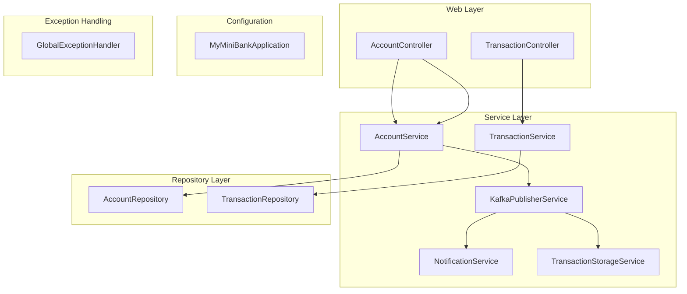

# 💼 MyMiniBank

Un projet Spring Boot minimaliste de gestion de comptes et transactions bancaires.

---

## 🔧 Fonctionnalités principales

- Création et consultation de comptes
- Récupération de transactions par compte
- Événements de transaction (Kafka)
- Service de notification
- Gestion des erreurs centralisée
- Validation personnalisée

---

## 🧱 Architecture technique

### Endpoints principaux

- `GET /account/{id}` → AccountController
- `POST /account` → AccountController
- `GET /transaction/{id}` → TransactionController

---

## 📁 Structure du projet

| Dossier / fichier | Rôle |
|------------------|------|
| `controller/`     | API REST |
| `service/`        | Logique métier |
| `repository/`     | Accès base de données |
| `model/`          | Entités métier |
| `dto/`            | Objets de transfert API |
| `events/`         | Gestion des événements |
| `validator/`      | Validation custom |
| `exception/`      | Gestion des erreurs globales |

---

## ✅ Stack technique

- Java 21 (Amazon Corretto)
- Spring Boot
- Spring Data JPA
- H2 Database (test)
- Kafka (via abstraction événementielle)
